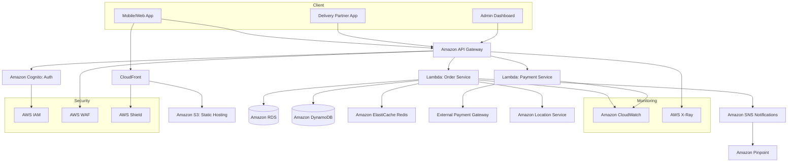
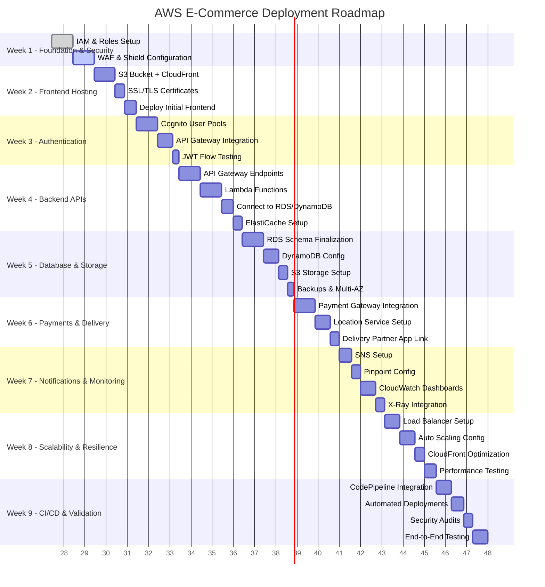

# Milkful — AWS Deployment Architecture, Roadmap & Cost Sheet

Companion to `milkful-system-design.md`. Covers the **cloud-native deployment view**, a
**phased delivery roadmap**, and an **India (Mumbai `ap-south-1`) cost estimate**.

Importable diagrams:

- `docs/design/milkful-deployment.drawio` — AWS deployment architecture
- `docs/design/milkful-roadmap.drawio` — deployment roadmap (Gantt timeline)

---

## 1. AWS Deployment Architecture

> This is the **MVP / pilot deployment view** (single-region, serverless-first). It maps to the
> broader microservices target in `milkful-system-design.md`; as scale grows, the two Lambda
> services expand into the full service set and steady services move to **ECS/EKS**.

---

## 2. AWS Deployment Roadmap (Gantt)

> **Timeline note:** the 9 phases are labelled "Week N" but, because tasks run **sequentially**
> (`after`), the durations add up to **~144 working days (~20–21 calendar weeks)**. Treat each
> section as a **phase**, not a literal calendar week. Many tasks can be **parallelized** (e.g.,
> frontend hosting alongside backend APIs) to compress the schedule.

---

## 3. Detailed AWS Cost Sheet (India — Mumbai `ap-south-1`)

### 3.1 Year 1 — Free Tier Coverage

| Service | Free Tier Limit | Expected Usage | Cost (INR/month) |
| --- | --- | --- | --- |
| EC2 (t3.micro) | 750 hrs/month (12 months) | 1 instance | ₹0 |
| RDS (db.t3.micro) | 750 hrs/month (12 months) | 1 instance | ₹0 |
| S3 Storage | 5 GB | 10 GB | ~₹20 |
| CloudFront | 1 GB transfer | 100 GB | ~₹700 |
| Lambda | 1M requests/month (always free) | ~500K requests | ₹0 |
| DynamoDB | 25 GB storage (always free) | 10 GB | ₹0 |
| SNS | 1M publishes/month (always free) | ~50K | ₹0 |
| Cognito | 50K MAUs (always free) | 5K MAUs | ₹0 |
| CloudWatch | 10 metrics free | ~20 metrics | ~₹150 |

**Estimated Year 1 Cost: ~₹850–900/month**

### 3.2 Year 2+ — Post Free Tier

| Service | Expected Usage | Cost (INR/month) |
| --- | --- | --- |
| EC2 (t3.micro) | 1 instance | ~₹650 |
| RDS (db.t3.micro) | 1 instance | ~₹1,200–1,500 |
| S3 Storage | 10 GB | ~₹20 |
| CloudFront | 100 GB transfer | ~₹700 |
| Lambda | 500K requests | ₹0 |
| DynamoDB | 10 GB storage | ~₹200 |
| SNS | 50K publishes | ₹0 |
| Cognito | 5K MAUs | ₹0 |
| CloudWatch | 20 metrics | ~₹150 |

**Estimated Year 2+ Cost: ~₹2,800–3,200/month (small scale)**

### 3.3 Scaling Scenarios

| Scale | Users / Orders | Monthly Cost (INR) | Key Drivers |
| --- | --- | --- | --- |
| Pilot (5K users) | 500 orders/day | ~₹900 (Year 1), ~₹3,000 (Year 2+) | CloudFront + RDS |
| City Launch (50K users) | 5K orders/day | ~₹20,000–25,000 | Larger RDS, CloudFront bandwidth |
| Regional Scale (500K users) | 50K orders/day | ~₹2.5–4 lakh | Multi-AZ RDS, ECS/EKS clusters, 10 TB CloudFront |

---

## 4. Notes & Assumptions

- **Indicative pricing.** Figures are estimates for planning; actuals vary with real traffic,
  data-transfer-out, storage growth, and **18% GST**. Validate with the
  [AWS Pricing Calculator](https://calculator.aws) before budgeting.
- **CloudFront free tier is larger than shown.** AWS now offers **1 TB/month egress + 10M
  requests always-free**, so 100 GB/month is likely **₹0** in practice — the ~₹700 line is a
  safe upper bound. It becomes a real cost driver only at city/regional scale.
- **12-month free tier** (EC2, RDS 750 hrs) applies to new accounts only; **always-free**
  tiers (Lambda, DynamoDB, SNS, Cognito) persist beyond year 1.
- **Architecture shift at scale.** The single-instance EC2/RDS and 2-Lambda picture fits the
  **pilot**. At **City Launch (5K orders/day)** move RDS to a larger/Multi-AZ instance (or
  **Aurora Serverless v2**) with a read replica; at **Regional Scale (50K orders/day)** adopt
  **ECS/EKS** for steady services, DynamoDB on-demand, and edge caching — matching the target
  architecture in `milkful-system-design.md`.
- **Peak load.** Milk delivery concentrates at ~6 AM. Pre-generate subscription orders the
  night before and use SQS buffering so cost tracks average, not peak, throughput.
- **Data transfer & NAT.** At scale, watch **inter-AZ transfer** and **NAT Gateway** charges —
  often underestimated. Prefer VPC endpoints for S3/DynamoDB.

---

## 5. How to open the diagrams

1. Open [app.diagrams.net](https://app.diagrams.net) → **File → Open From → Device**.
2. Select `milkful-deployment.drawio` (architecture) or `milkful-roadmap.drawio` (timeline).
